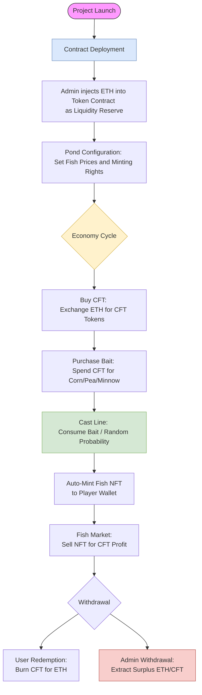
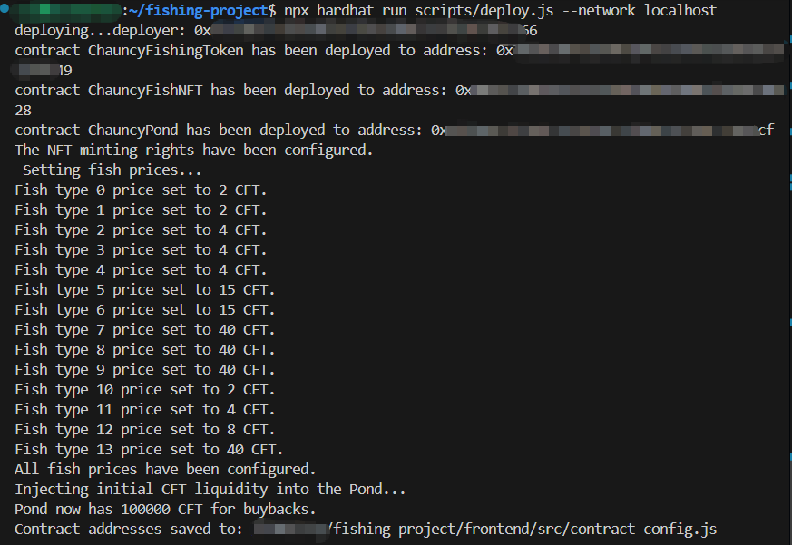
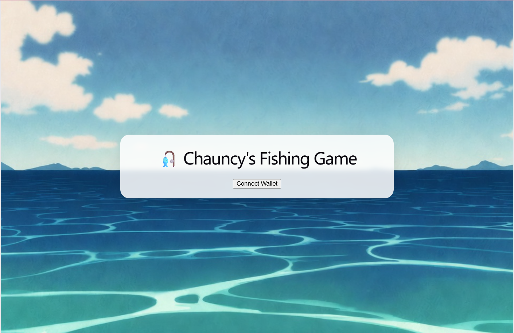
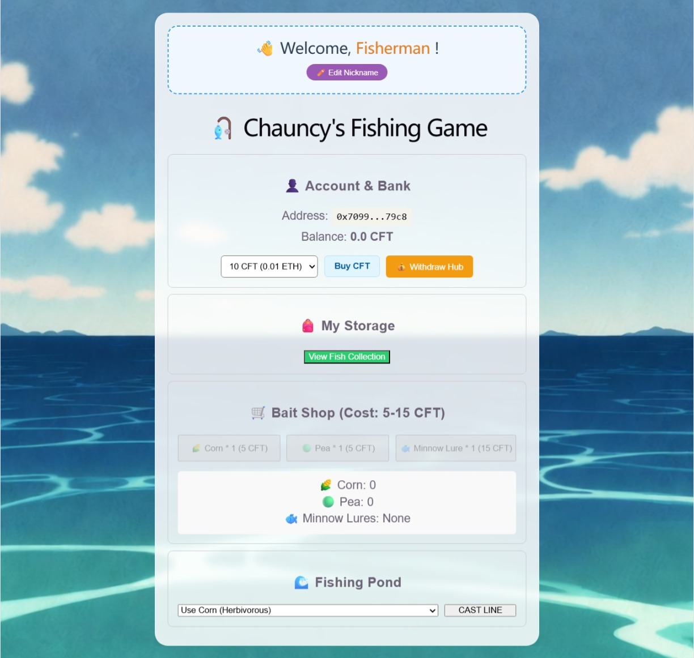
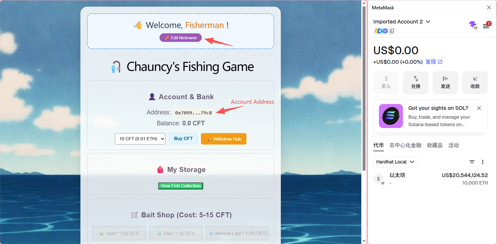
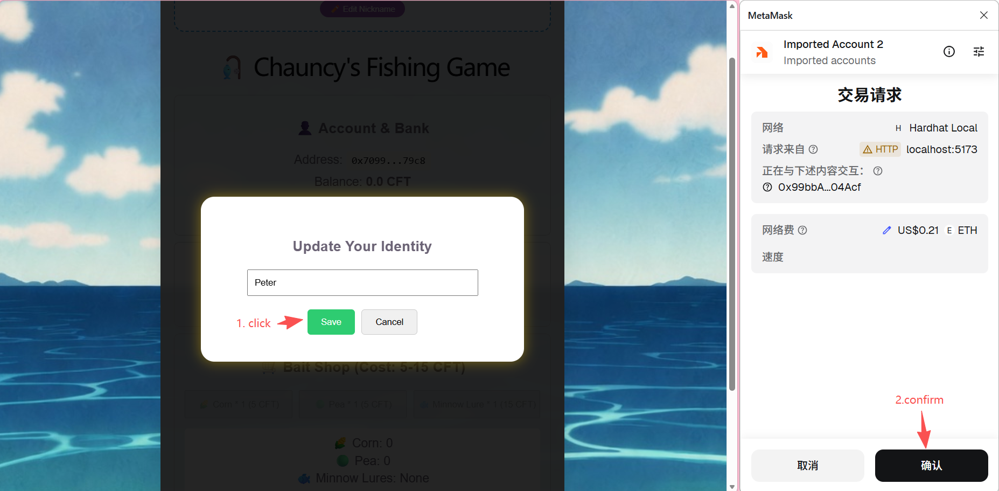
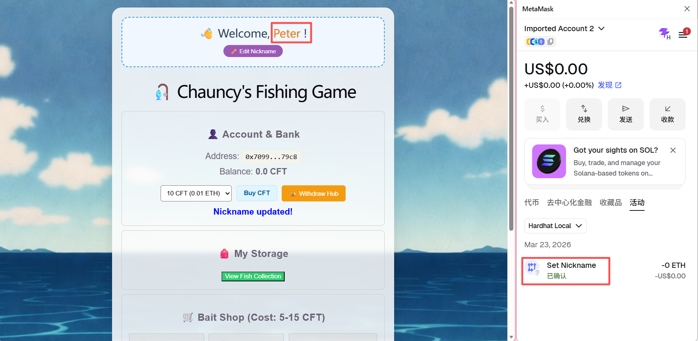
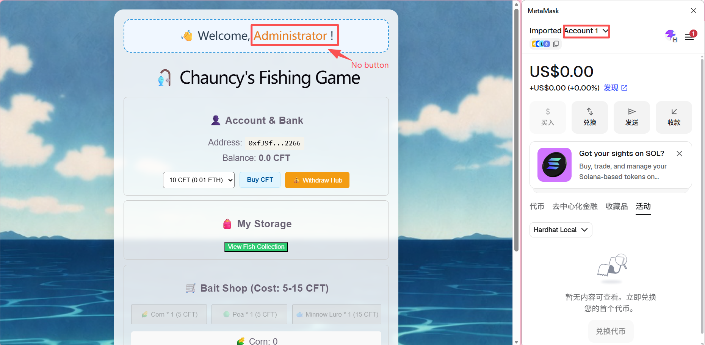

# 🎣 Chauncy's Fishing Game 

A decentralized fishing simulation game developed as a hands-on project to master Web3 development concepts. Players can buy bait using custom tokens, catch unique fish NFTs, and manage their earnings through a financial hub.

> **⚠️ Disclaimer**: 
> This project is developed strictly for **educational and personal learning purposes** only. It has **no commercial intent**. 
> 
> Currently, the game is **not deployed** on any public testnets or mainnets. It is designed to run and be tested exclusively in a **local development environment** (e.g., Hardhat node). 
> 
> This project demonstrates the technical integration of ERC-20 and ERC-721 standards, showcasing how smart contracts manage game logic, random probability, and financial liquidity in a controlled, local setting.

## 🚀 Learning Objectives
This project was created to explore and implement:
* **Smart Contract Development:** Writing, testing, and deploying secure contracts.
* **Tokenomics:** Implementing a dual-token system (ERC-20 for currency and ERC-721 for collectibles).
* **Frontend Integration:** Connecting a React UI to the blockchain using Ethers.js.
* **Asset Management:** Handling NFT metadata and media via IPFS (Pinata).

## 🛠️ Tech Stack
* **Blockchain Framework:** [Hardhat](https://hardhat.org/) (Development, testing, and local node deployment)
* **Smart Contracts:** Solidity (ERC-20 & ERC-721)
* **Frontend:** React.js
* **Web3 Library:** Ethers.js (v6)
* **Storage:** Pinata / IPFS (NFT Images & Metadata)
* **Wallet:** MetaMask

## ⚠️ Current Status: Local Deployment
Please note that this project is currently configured for **Localhost only**. 
* The contracts are deployed on a local Hardhat node.
* It is not currently live on any public Testnets.
* All assets and transactions shown in the demonstrations are running on a local development environment.

## Core Features & Logic (Current Progress)

1. Tokenomics (ERC20): Implements a buyTokens mechanism allowing players to deposit ETH and mint CFT tokens at a fixed rate of 1:1000.

2. Bait System: Supports multiple bait types (Corn, Pea, Minnow Lure), each corresponding to different fish dietary groups (Herbivorous, Carnivorous, Omnivorous).

3. On-chain Randomness: Utilizes a combination of block.prevrandao and keccak256 hashing to determine fishing outcomes and species rarity.

4. NFT Persistence (ERC721): Caught fish are minted as unique NFTs with their species ID permanently mapped on-chain, ensuring metadata consistency via IPFS.

## 🎮 Detailed Introduction

**Chauncy's Fishing Game** is a decentralized mini-game developed as an introductory project for learning Web3 development. The ecosystem features a custom utility token, **ChauncyFishingToken (CFT)**, and a unique collection of Non-Fungible Tokens, **Chauncy Fish (CFISH)**.

By connecting their Web3 wallets, users can engage in a complete on-chain circular economy:

### 🪙 Token Economy & Assets
* **ChauncyFishingToken (CFT)**: The primary in-game currency used for all transactions.
* **Chauncy Fish (CFISH)**: ERC-721 NFTs representing the fish caught by players, featuring unique metadata and scarcity.

### 🎣 Core Gameplay Features

1.  **Token Exchange (Swap)**: Seamlessly exchange **ETH** for **CFT** to kickstart your fishing journey.
2.  **Bait Shop**: Spend your **CFT** to purchase different types of bait. Currently, three tiers are available:
    * 🌽 **Corn** 
    * 🫛 **Pea** 
    * 🐟 **Minnow Lure** 
3.  **On-chain Fishing**: Cast your line using your bait to catch a **CFISH**. The result is determined by on-chain logic, yielding fish with randomized rarities ranging from **1-Star to 5-Stars**.
4.  **NFT Marketplace (Buyback)**: 
    * **Collect**: You may choose to hold your CFISH.
    * **Sell**: Liquidate your CFISH back to the game shop in exchange for **CFT**. The payout scales with the star-rating (rarity) of the fish.
5.  **Withdrawal**: At any time, users can choose to convert their **CFT** back into **ETH**, which is then transferred directly to their personal wallet.

### ▶️ Process Diagram

**Here is a flowchart illustrating the logic above.**

## 🎞 Demonstration Screenshots & Videos.

### Contract Deployment Phase
The project is deployed using a local Hardhat environment. By default, Hardhat's test account **Account #0** is used as the contract owner.

During the deployment phase, the following key steps are performed:

1. **Deploy core contracts**  
   All necessary smart contracts are deployed to the local blockchain.

2. **Set pricing for the 14 fish NFTs**  
   The contract owner configures the corresponding CFT prices for each of the 14 different fish NFT types in the pond.

3. **Inject initial liquidity / startup funds**  
   The contract owner transfers an initial amount of ETH to the contract address. This ETH serves as the liquidity reserve / backing pool for token redemptions and the overall economy.

### Start Playing The Game

Upon arriving at the welcome screen, the user clicks **Connect Wallet** to enter the main interface.

Upon entering the main page, users can perform the following actions:

1. **Set or edit an in-game nickname**

    Users can assign themselves a nickname for use within the game and edit it at any time.

    

    

    Enter your desired new nickname and click confirm in the authorization interface that pops up in Metamask.

    

    We have now successfully changed the nickname from the default "Fisherman" to "Peter".

    (Note: The contract owner is restricted from using this feature and can only use the nickname "Administrator".)

    

2. **Exchange for CFT to start the fishing adventure**
    Users can swap ETH for CFT tokens to obtain the in-game currency required for gameplay.
   
    https://github.com/user-attachments/assets/0a6c3517-6459-4d50-9cda-9b0dd006f82c

    

4. **Purchase bait and lures (when eligible)**

    If the user holds a valid amount of CFT, the buttons to purchase bait and fake lures become available.

    Users can buy two types of real bait (Corn & Pea) and one type of Minnow fake lure.

    https://github.com/user-attachments/assets/b7711855-f6e4-43fa-af2a-1db56706a2ca

6. **Cast the line**

    As long as the user holds at least one bait item, they can cast their line to begin fishing.

    https://github.com/user-attachments/assets/f18fa89e-e5d7-4907-960d-5423938685a3
    
8. **View Fish Collection**

   After successfully catching a fish, users can click the **View Fish Collection** button to browse the CFISH NFTs they own in their wallet.
   They can choose to **sell** the NFT or keep it for now.

   https://github.com/user-attachments/assets/178a8580-9c3f-4cf0-a201-602d4b6f7afb

6. **Withdraw via Withdraw Hub**

   Users can click the **Withdraw Hub** button to redeem their accumulated CFT tokens for ETH, which will then be sent directly to their connected wallet.

   https://github.com/user-attachments/assets/f10180f5-21f9-49f9-aeb7-232c3f10fbc3

### From The Perspective Of The Constract Holder

   **Next, let's play the game from the perspective of the contract holder.**

   No need to refresh the webpage. You only need to switch to Account 1 in your wallet, click any transaction button in the game, and security restrictions will block the transaction and automatically connect to your current wallet account.

   https://github.com/user-attachments/assets/ecfd2af1-44d2-432f-a855-a2f8a2448d5d

   As mentioned before, the contract owner uses the default nickname "Administrator" and cannot change it. However, the owner can view the ETH balance in the current contract address and withdraw it to his/her own account. (Of course, I've restricted the owner account to leaving some as a reserve fund in the bank.)

   https://github.com/user-attachments/assets/80b22fc5-452e-4548-a510-f268e2a4652f

   In other respects, the contract owner is the same as the regular player.

## Development Logs

### 2026-03-18
- **[Architecture] NFT Species Binding**: Introduced idToSpecies mapping in ChauncyFishNFT.sol to permanently link a tokenId to its biological species (0-13) on-chain.

- **[Fix] Interface Synchronization**: Resolved a critical TypeError (Wrong argument count) by synchronizing the mintFish function signature across the Pond interface and the NFT contract.

- **[Optimization] Dynamic Metadata**: Refactored tokenURI to use the on-chain idToSpecies value, enabling the dynamic generation of IPFS metadata links (e.g., ipfs://.../{species}.json).

- **[Git] Version Control**: Initialized Git repository and configured a comprehensive .gitignore to protect sensitive .env files and exclude heavy node_modules and build artifacts.

### 2026-03-19
- **[Develop] Frontend UI development**: Designed and implemented the front-end components of a portion of the program.

- **Asset Integration**: Successfully imported and mapped all 14 fish species' sprites from assets/fishes.

- **Visual Effects**:  Added a "silhouette" effect (using CSS filters) for uncollected fish to enhance the exploration and collection experience.

- **Smart Contract & Frontend Integration**:  * Implemented getFullCollection in the NFT contract for efficient batch querying of player holdings.

Fixed a critical "revert" bug during the CastLine process by optimizing Gas limits and internal function calls.

Resolved an issue where fish types were repetitive due to local block timestamp limitations by introducing a nonce to the PRNG logic.

### 2026-03-20
- **[Develop] Frontend UI development**: Successfully integrated with the backend for the fish-selling feature.

- **backend development**: New features have been added: 
    1. Catch probabilities and sale prices have been established for fish species of varying rarity levels. 
    2. The contract owner now injects initial capital into the contract during deployment. 
    3. Users can now sell their FishNFTs in exchange for CFT, and subsequently withdraw their CFT holdings as ETH. 
    4. The codebase now supports the contract owner withdrawing ETH from the contract account.

### 2026-03-21
- **[Develop] Frontend UI development**: 
    1. Implemented the functionality allowing the contract owner to withdraw ETH from the contract address.
    2. Completed the frontend functionality allowing users to withdraw all of their CFT.

    The development tasks are basically completed; final debugging will be conducted tomorrow.

### 2026-03-22
- **[Develop] Frontend UI development**: Development tasks are basically completed; debug and improve UI display and optimize functionality.
